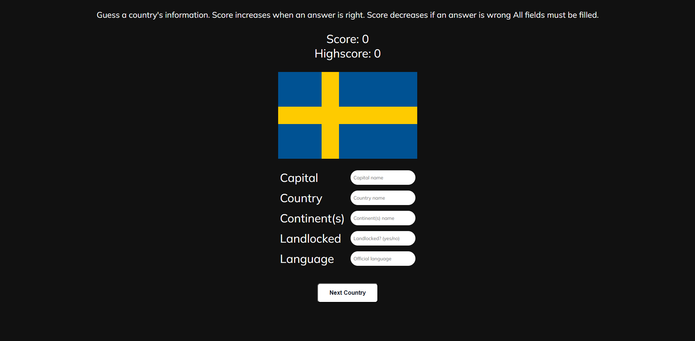

# Country Guessing Game



## Description

A fun and interactive geography quiz where you guess key details about a random country. This game challenges you to identify a country's **capital**, **name**, **continent**, **landlocked status**, and **official language** based on its flag.

## Features

- Displays the flag of a randomly selected country.
- Prompts the user to guess:
  - Capital
  - Country name
  - Continent (or continents)
  - Whether it is landlocked
  - One official language
- Score increases for each correct answer and decreases for incorrect ones.
- Highscore tracking.
- Error handling for empty fields and API issues.

## Technologies Used

- JavaScript (ES6 Modules)
- HTML
- CSS
- [REST Countries API v3.1](https://restcountries.com/)

## Getting Started

1. **Clone the repository:**

   ```bash
   git clone https://github.com/functionexpression/country-guessing-game.git
   ```

## License

This project is licensed under the [MIT License](LICENSE).
